# Homelab Infrastructure - Cloudflare Tunnel + K3s

## Visao Geral

Infraestrutura homelab exposta para internet via **Cloudflare Tunnel**, rodando em um cluster **K3s** single-node. Todo o trafego externo passa pelo Cloudflare, que atua como proxy reverso com SSL automatico, protecao DDoS e CDN — sem necessidade de abrir portas no roteador.

**Dominio:** `artjason.com`
**Gerenciado via:** Cloudflare DNS + Zero Trust Tunnel

---

## Arquitetura Geral

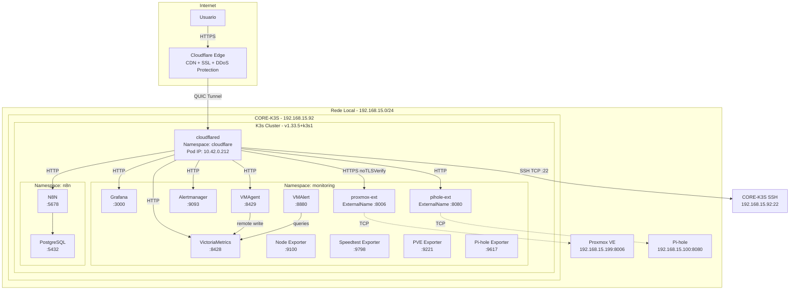

---

## Como o Cloudflare Tunnel Funciona

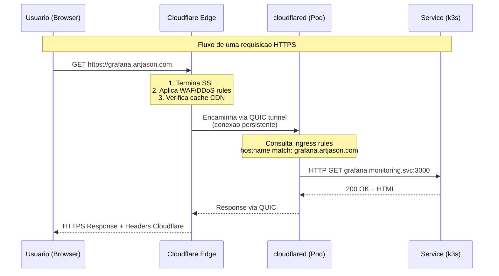

### Principios do Tunnel

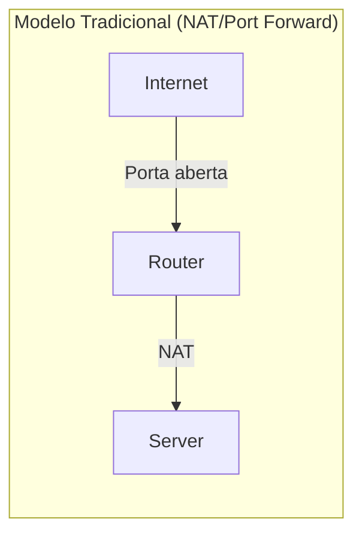

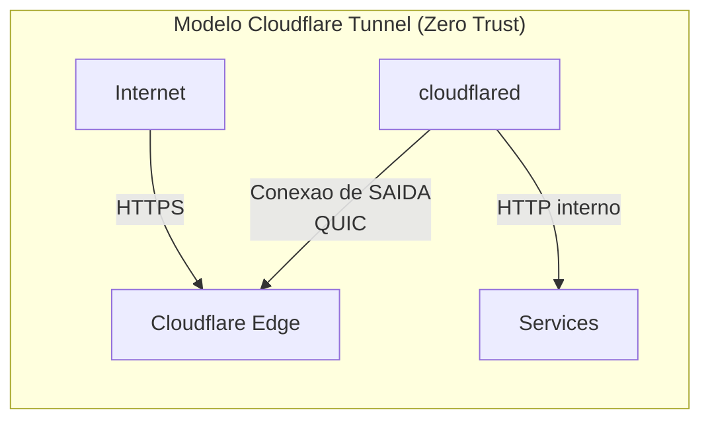

**Diferenca fundamental:** O cloudflared inicia uma conexao de **saida** para o Cloudflare. Nenhuma porta precisa ser aberta no firewall/roteador. O Cloudflare funciona como intermediario, roteando o trafego externo pelo tunnel ja estabelecido.

---

## Servicos Expostos

| FQDN | Servico K8s | Namespace | Porta | Protocolo Origin | Descricao |
|------|-------------|-----------|-------|-----------------|-----------|
| `grafana.artjason.com` | `grafana` | monitoring | 3000 | HTTP | Dashboards de monitoramento |
| `victoriametrics.artjason.com` | `victoriametrics` | monitoring | 8428 | HTTP | TSDB - armazenamento de metricas |
| `vmagent.artjason.com` | `vmagent` | monitoring | 8429 | HTTP | Agente de coleta de metricas |
| `alertmanager.artjason.com` | `alertmanager` | monitoring | 9093 | HTTP | Gerenciamento de alertas |
| `proxmox.artjason.com` | `proxmox-ext` | monitoring | 8006 | HTTPS (noTLSVerify) | Hypervisor Proxmox VE |
| `pihole.artjason.com/admin` | `pihole-ext` | monitoring | 8080 | HTTP | DNS ad-blocker admin |
| `n8n.artjason.com` | `n8n` | n8n | 80→5678 | HTTP | Automacao de workflows |
| `ssh.artjason.com` | — (host direto) | — | 22 | SSH/TCP | Acesso SSH remoto ao CORE-K3S |

---

## Infraestrutura do Cluster

### Node

| Campo | Valor |
|-------|-------|
| Hostname | `ubuntu` (CORE-K3S) |
| IP | `192.168.15.92` |
| OS | Ubuntu 22.04.5 LTS |
| Kernel | 5.15.0-164-generic |
| K3s | v1.33.5+k3s1 |
| Container Runtime | containerd 2.1.4-k3s1 |
| Roles | control-plane, master |

### Namespaces

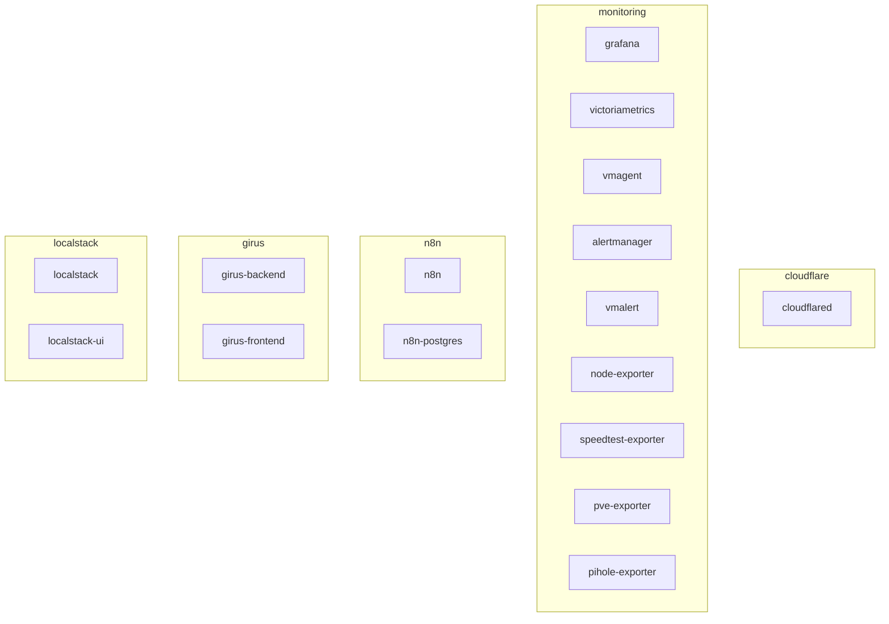

### Persistent Volumes

| PVC | Namespace | Capacidade | StorageClass |
|-----|-----------|-----------|--------------|
| `victoria-data` | monitoring | 8Gi | manual |
| `grafana-pvc` | monitoring | 1Gi | manual |
| `alertmanager-pvc` | monitoring | 1Gi | manual |
| `pihole-etc` | monitoring | 1Gi | manual |
| `pihole-dnsmasq` | monitoring | 256Mi | manual |
| `n8n-data` | n8n | 5Gi | local-path |
| `n8n-postgres-data` | n8n | 10Gi | local-path |

---

## Stack de Monitoramento

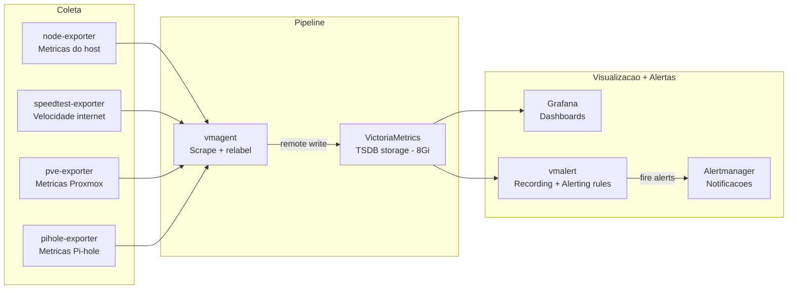

### Dispositivos Externos Monitorados

| Dispositivo | IP | Servico K8s | Metodo |
|------------|-----|-------------|--------|
| Proxmox VE | 192.168.15.199 | `proxmox-ext:8006` | ExternalName + pve-exporter |
| Pi-hole | 192.168.15.100 | `pihole-ext:8080` | ExternalName + pihole-exporter |

---

## Cloudflare - Configuracao

### Credenciais

| Campo | Valor |
|-------|-------|
| Account ID | `f141d929299f801ff724b60144e80eff` |
| Zone ID | `e0ef70353a42dd87bfed09e0784c9ed7` |
| Tunnel ID | `578337b6-1459-4b06-8848-43783a90f00d` |
| API Token | Salvo em `~/cloudflare-tunnel-token.txt` |
| Tunnel Token | Salvo em `~/cloudflare-tunnel-token.txt` e no Secret `cloudflare-tunnel-token` |

### DNS Records

Todos os subdomains sao CNAME records apontando para `578337b6-1459-4b06-8848-43783a90f00d.cfargotunnel.com` com proxy ativado (orange cloud).

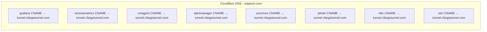

### Tunnel Connections

O cloudflared mantem **4 conexoes QUIC simultaneas** com o Cloudflare Edge, distribuidas em multiplos PoPs (Points of Presence) no datacenter de **Guarulhos/SP (GRU)**:

- `connIndex=0` → gru05
- `connIndex=1` → gru19
- `connIndex=2` → gru08/gru17
- `connIndex=3` → gru05

Isso garante alta disponibilidade — se uma conexao cair, as outras continuam servindo.

---

## Como o Cloudflare Tunnel Funciona (Deep Dive)

### O Problema: NAT e Firewall bloqueiam conexoes de entrada

```
Internet → Roteador (NAT/Firewall) → 192.168.15.92
                    ↑
             Bloqueia ENTRADA
             Permite SAIDA
```

### A Solucao: Inverter a direcao da conexao

O `cloudflared` inicia uma conexao de **saida** para o Cloudflare. O roteador nao bloqueia saida.
Essa conexao QUIC fica **aberta permanentemente** como um tunel bidirecional.

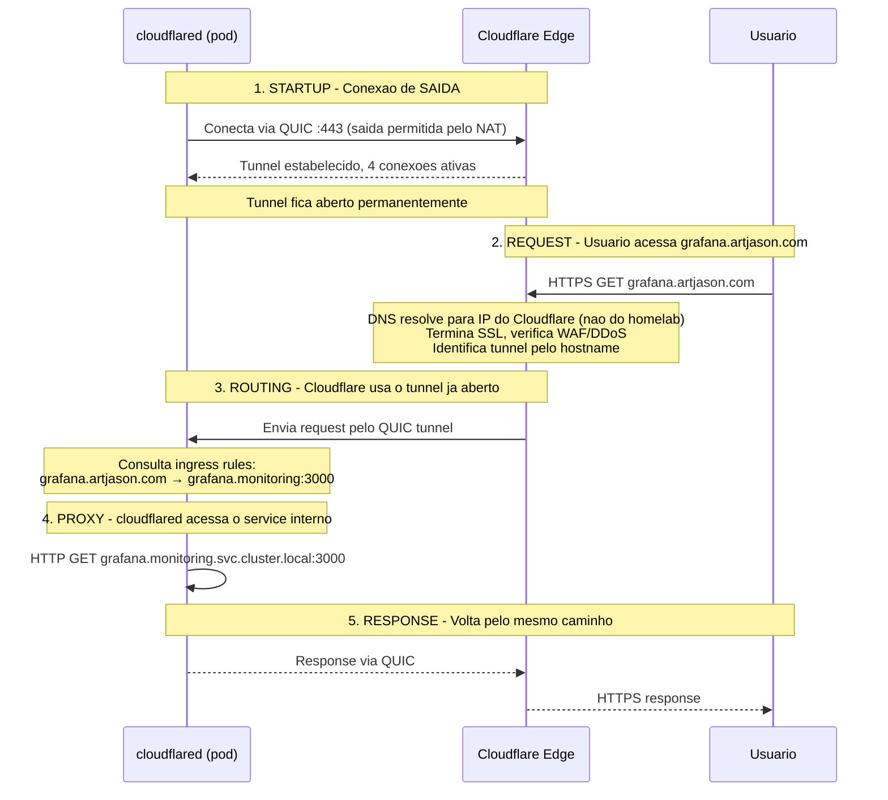

### Anatomia do Token

O tunnel token em base64 contem:

```json
{
  "a": "f141d929299f801ff724b60144e80eff",     // Account ID - sua conta Cloudflare
  "t": "578337b6-1459-4b06-8848-43783a90f00d", // Tunnel ID - identidade do tunnel
  "s": "Y2RkOWM1OTkt..."                       // Secret - chave de autenticacao
}
```

Qualquer maquina que rodar `cloudflared run --token <TOKEN>` se registra como connector deste tunnel.
**O token e a identidade completa — mantenha seguro.**

### Tunnel vs Connector vs Connection

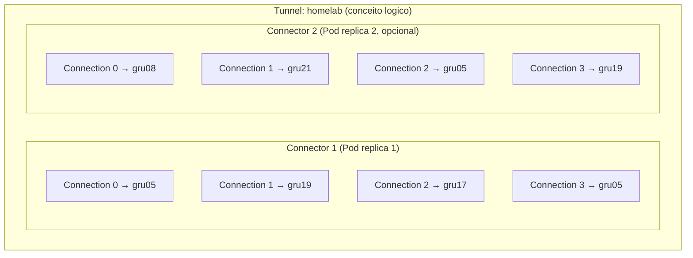

| Conceito | O que e | Quantidade |
|----------|---------|-----------|
| **Tunnel** | Identidade logica com nome, token e ingress rules | 1 por localidade/proposito |
| **Connector** | Instancia do cloudflared registrada no tunnel | 1 por pod/maquina |
| **Connection** | Conexao QUIC com um PoP do Cloudflare | 4 por connector |

### Mesmo Token em Maquinas Diferentes: Quando Usar

**MESMO tunnel (mesmo token)** — para redundancia na MESMA rede:

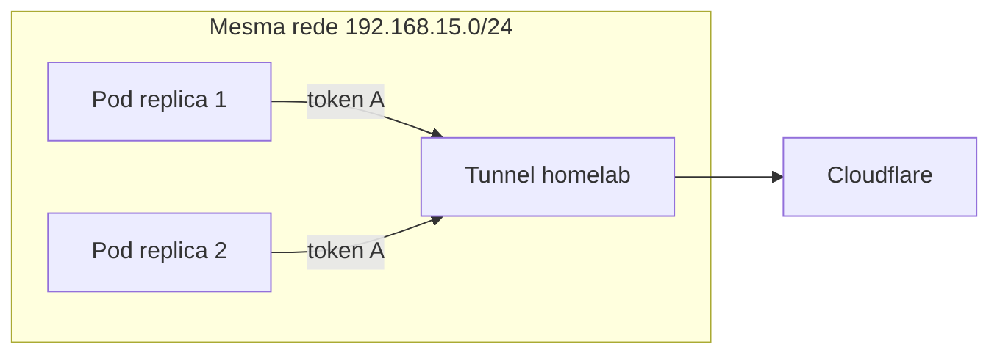

Ambos acessam os mesmos services. Cloudflare faz load balance. Faz sentido.

**TUNNELS DIFERENTES (tokens diferentes)** — para maquinas em locais diferentes:

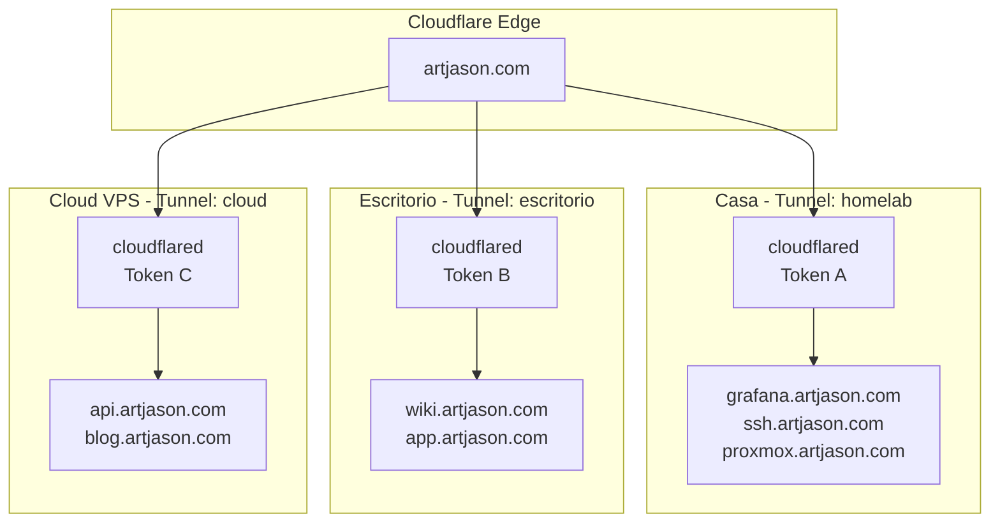

Cada tunnel tem suas proprias ingress rules. O Cloudflare sabe qual tunnel serve qual hostname.
Todos compartilham o mesmo dominio `artjason.com`.

**Regra pratica:**
- Mesma rede, mesmos services → mesmo tunnel (escalar replicas)
- Rede diferente, services diferentes → tunnel diferente (novo token)

### Por que SSH Precisa de ProxyCommand

O SSH tenta conexao TCP direta na porta 22. Mas `ssh.artjason.com` resolve para IPs do Cloudflare, que so aceitam HTTPS.

```
SEM ProxyCommand (falha):
  ssh → TCP :22 → 104.21.17.241 (Cloudflare) → RECUSADO (nao tem porta 22)

COM ProxyCommand (funciona):
  ssh → cloudflared access ssh → HTTPS :443 → Cloudflare → tunnel → TCP :22 → SSHD
```

O `cloudflared access ssh` cria um pipe HTTPS que carrega os bytes SSH por dentro:

```
[SSH bytes] → [HTTPS wrapper] → [QUIC tunnel] → [TCP para :22 no destino]
```

O `ProxyCommand` no SSH config diz ao client: "Nao conecte direto. Use este programa como intermediario."

```sshconfig
Host CORE-K3S-REMOTE
    HostName ssh.artjason.com
    User homelab
    ProxyCommand cloudflared access ssh --hostname %h
    # %h e substituido por ssh.artjason.com automaticamente
```

---

## Estrutura dos Manifests

```
cloudflare/
├── kustomization.yaml                  # Raiz - aplica tudo com: kubectl apply -k .
│
├── tunnel/                             # Cloudflare Tunnel (cloudflared)
│   ├── kustomization.yaml
│   ├── namespace.yaml                  # Namespace: cloudflare
│   ├── secret.yaml                     # Tunnel token
│   └── deployment.yaml                 # cloudflared pod
│
├── monitoring/                         # Patches dos deployments de monitoring
│   ├── kustomization.yaml
│   ├── grafana.yaml                    # GF_SERVER_ROOT_URL → grafana.artjason.com
│   ├── victoriametrics.yaml            # Sem --http.pathPrefix
│   ├── vmagent.yaml                    # Sem --http.pathPrefix + remoteWrite corrigido
│   └── alertmanager.yaml               # Sem --web.route-prefix
│
├── n8n/                                # Patches do N8N
│   ├── kustomization.yaml
│   ├── n8n.yaml                        # N8N_HOST/WEBHOOK → n8n.artjason.com
│   └── service.yaml                    # ClusterIP (porta 80 → 5678)
│
└── DOCS.md                            # Esta documentacao
```

### Deploy

```bash
# Aplicar tudo de uma vez
scp -r cloudflare/ CORE-K3S:/tmp/cloudflare-deploy
ssh CORE-K3S "kubectl apply -k /tmp/cloudflare-deploy"

# Aplicar apenas o tunnel
ssh CORE-K3S "kubectl apply -k /tmp/cloudflare-deploy/tunnel"

# Aplicar apenas monitoring patches
ssh CORE-K3S "kubectl apply -k /tmp/cloudflare-deploy/monitoring"
```

---

## Como Adicionar um Novo Servico

### 1. Configurar o tunnel (Cloudflare API)

```bash
# Buscar config atual
curl -s "https://api.cloudflare.com/client/v4/accounts/ACCOUNT_ID/cfd_tunnel/TUNNEL_ID/configurations" \
  -H "Authorization: Bearer API_TOKEN" | jq .

# Atualizar ingress (adicionar o novo hostname no array + manter catch-all no final)
curl -X PUT "https://api.cloudflare.com/client/v4/accounts/ACCOUNT_ID/cfd_tunnel/TUNNEL_ID/configurations" \
  -H "Authorization: Bearer API_TOKEN" \
  -H "Content-Type: application/json" \
  --data '{"config":{"ingress":[
    ...hostnames existentes...,
    {"hostname":"novo.artjason.com","service":"http://svc.namespace.svc.cluster.local:PORT","originRequest":{}},
    {"service":"http_status:404"}
  ]}}'
```

### 2. Criar DNS CNAME

```bash
curl -X POST "https://api.cloudflare.com/client/v4/zones/ZONE_ID/dns_records" \
  -H "Authorization: Bearer API_TOKEN" \
  -H "Content-Type: application/json" \
  --data '{
    "type": "CNAME",
    "name": "novo",
    "content": "TUNNEL_ID.cfargotunnel.com",
    "proxied": true,
    "ttl": 1
  }'
```

### 3. Pronto

O cloudflared recebe a nova config automaticamente (push do Cloudflare). Nao precisa restart.

---

## Acesso Remoto SSH

Acesso SSH ao CORE-K3S via Cloudflare Tunnel, sem abrir portas no roteador.

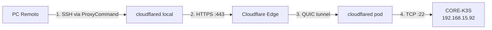

### Pre-requisitos no client

1. Instalar `cloudflared`:
```bash
curl -sL https://github.com/cloudflare/cloudflared/releases/latest/download/cloudflared-linux-amd64 -o ~/.local/bin/cloudflared
chmod +x ~/.local/bin/cloudflared
```

2. Adicionar ao `~/.ssh/config`:
```sshconfig
Host CORE-K3S-REMOTE
    HostName ssh.artjason.com
    User homelab
    ProxyCommand cloudflared access ssh --hostname %h
```

3. Conectar:
```bash
ssh CORE-K3S-REMOTE
```

### Como funciona

- O `ProxyCommand` faz o `cloudflared` criar um tunnel temporario ate o Cloudflare Edge
- O Edge roteia para o pod `cloudflared` no k3s via QUIC
- O pod encaminha para `ssh://192.168.15.92:22`
- Nenhuma porta aberta no roteador, trafego sai pela porta 443 (HTTPS)

---

## Seguranca

### O que o Cloudflare fornece automaticamente

- **SSL/TLS** - Certificados automaticos para todos os subdomains
- **DDoS Protection** - Mitigacao na borda
- **WAF** - Web Application Firewall basico
- **Bot Management** - Protecao contra bots
- **IP Hiding** - O IP real do homelab nunca e exposto

### Recomendacoes

- [ ] Trocar senha do Grafana (`admin/admin`) para algo seguro
- [ ] Mover `GF_SECURITY_ADMIN_PASSWORD` para um Kubernetes Secret
- [ ] Configurar **Cloudflare Access** (Zero Trust) para restringir acesso aos servicos
- [ ] Habilitar **2FA** na conta Cloudflare
- [ ] Rotacionar o API Token periodicamente

---

## Troubleshooting

### Verificar status do tunnel

```bash
ssh CORE-K3S "kubectl logs -n cloudflare -l app=cloudflared --tail=20"
```

### Verificar se todos os servicos respondem

```bash
for sub in grafana victoriametrics vmagent alertmanager proxmox pihole n8n; do
  curl -sL -o /dev/null -w "$sub.artjason.com -> HTTP %{http_code}\n" \
    --max-time 10 "https://$sub.artjason.com"
done
```

### Servico retorna 502 Bad Gateway

O cloudflared nao consegue alcançar o service interno. Verificar:

```bash
# Pod do servico esta rodando?
ssh CORE-K3S "kubectl get pods -n NAMESPACE -l app=SERVICE"

# Service resolve corretamente?
ssh CORE-K3S "kubectl exec -n cloudflare deploy/cloudflared -- nslookup SERVICE.NAMESPACE.svc.cluster.local"
```

### Servico redireciona para URL antiga

O servico tem configuracao de `root_url` ou `route-prefix` apontando para o dominio antigo. Verificar envs/args do deployment.

### DNS nao resolve

```bash
# Verificar se CNAME existe
dig +short SUBDOMAIN.artjason.com

# Se vazio, criar via API (ver secao "Como Adicionar um Novo Servico")
```

### SSH nao conecta

```bash
# 1. Verificar se cloudflared esta instalado no client
cloudflared --version

# 2. Testar manualmente
ssh -o ProxyCommand="cloudflared access ssh --hostname ssh.artjason.com" homelab@ssh.artjason.com

# 3. Se falhar, testar o tunnel direto
cloudflared access ssh --hostname ssh.artjason.com
# Deve abrir um pipe. Se der erro, o tunnel ou DNS esta com problema.

# 4. Verificar se o SSHD esta rodando no host
ssh CORE-K3S "systemctl status sshd"
```

### Como adicionar um novo tunnel (outra localidade)

```bash
# 1. No dashboard: Zero Trust → Networks → Tunnels → Create
# 2. Nome: "escritorio" (ou o que quiser)
# 3. Copiar o novo token
# 4. Instalar cloudflared na maquina remota com o novo token
# 5. Configurar ingress rules via API usando o novo Tunnel ID
# 6. Criar CNAMEs apontando para o novo TUNNEL_ID.cfargotunnel.com
```
