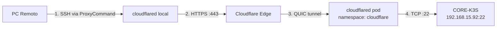

# Plano de Acao - SSH via Cloudflare Tunnel

## Objetivo

Permitir acesso SSH remoto ao CORE-K3S (192.168.15.92) via `ssh.artjason.com`, sem abrir portas no roteador, usando `cloudflared access` como proxy.

## Arquitetura



## Steps

### Step 1 — Adicionar hostname SSH no Cloudflare Tunnel (API)

**O que:** Adicionar `ssh.artjason.com` nas ingress rules do tunnel apontando para `ssh://192.168.15.92:22`.

**Como:** PUT na API do Cloudflare adicionando a nova entrada na lista de ingress existente.

**Validacao:** `curl -s API/configurations | jq` deve mostrar `ssh.artjason.com` na lista.

---

### Step 2 — Criar CNAME DNS

**O que:** Criar record `ssh.artjason.com` CNAME para `578337b6-1459-4b06-8848-43783a90f00d.cfargotunnel.com` com proxy ativado.

**Como:** POST na API de DNS do Cloudflare.

**Validacao:** `dig +short ssh.artjason.com` deve retornar IPs do Cloudflare.

---

### Step 3 — Verificar que o tunnel atualizou

**O que:** O cloudflared recebe a nova config via push automatico. Confirmar nos logs.

**Como:** `kubectl logs -n cloudflare -l app=cloudflared --tail=5`

**Validacao:** Log deve conter `Updated to new configuration` com `ssh.artjason.com` na lista.

---

### Step 4 — Testar conexao SSH

**O que:** Testar o acesso SSH passando pelo tunnel.

**Como:**
```bash
cloudflared access ssh --hostname ssh.artjason.com
```

**Validacao:** Sessao SSH aberta com sucesso.

---

### Step 5 — Configurar SSH config permanente

**O que:** Adicionar entrada no `~/.ssh/config` para que `ssh CORE-K3S-REMOTE` funcione automaticamente via tunnel.

**Como:**
```sshconfig
Host CORE-K3S-REMOTE
    HostName ssh.artjason.com
    User homelab
    ProxyCommand cloudflared access ssh --hostname %h
```

**Validacao:** `ssh CORE-K3S-REMOTE` conecta sem precisar de comandos extras.

---

### Step 6 — Atualizar manifests e documentacao

**O que:** Atualizar o configmap local e a DOCS.md para refletir o novo servico SSH.

**Arquivos:**
- `tunnel/configmap.yaml` — adicionar entrada ssh (referencia local)
- `DOCS.md` — adicionar ssh na tabela de servicos e secao de acesso remoto

**Validacao:** Manifests e doc atualizados no repositorio.

---

## Rollback

Se algo der errado:
1. Remover `ssh.artjason.com` da config do tunnel via API (PUT sem a entrada)
2. Deletar o CNAME via API
3. O tunnel atualiza automaticamente

## Riscos

- **Baixo:** SSH exposto sem autenticacao adicional alem de senha/chave SSH
- **Mitigacao futura:** Configurar Cloudflare Access policy para exigir login antes de chegar no SSH
